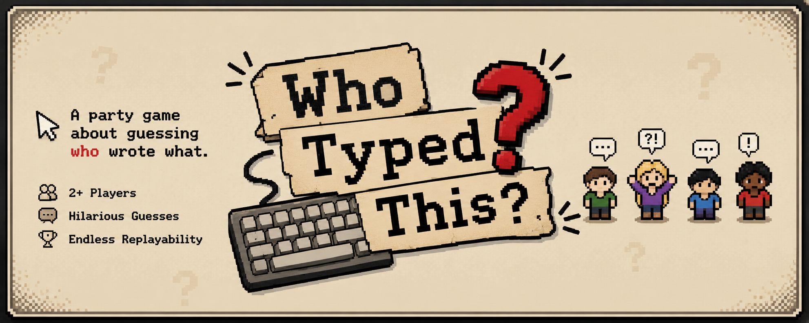

<p align="center">
    
</p>

# 🎭 Who Typed This? v2.0 is alive and making friendships questionable
<p align="center">
  
</p>

### multiplayer typing game where friends compete, lie, and slowly lose trust in each other.

Live demo: [https://whotypedthis1.vercel.app/](https://whotypedthis1.vercel.app/)

---

## AI declaration
UPDATE [10/07/2026]: As today i have redesigned all the AI visuals, using Wacom Graphic Tablet drawing, and also fonts from Canva, the banner is made using Canva.
Now i can say i haven't used any AI in my project, and also my commit history is well organized...

----------------------------------

ok so i want be honest here,

the logo and most of the desgin and images and colors was made with AI helping me. also some room ideas and layouts was generated with AI too because i was trying many differnt ideas and seeing what looks better.

but i didnt just copy every thing. i changed alot of stuff myself and used my own knowledge and coding. AI was helping and giving suggesstions but the final thing is edited by me.

also when there was bugs or errors sometime AI helped finding them faster. not every code or desgin here was made by AI, it was more like a tool helping during development.

---

## How it works

1. every one type a messege anonmously in the room
2. then peoples try guess who writed it
3. arguments starts almost instantly
4. nobody trust nobody anymore
5. game continue until someone rage quit or leave for no reason

---

## Gameplay example

Write messege about Ahmed:

> "he still using internet explorer lol"

what happen next:

* Ahmed start defending him self way too much
* Sarah somehow get offended
* someone vote random because "i feel its him"
* one player become complete silent and never talks again

this is normal. and happen alot.

---

## Features

### Multiplayer rooms

make room and invite your friends.

or invite peoples you dont like.

both usually ends same result honestly.

### Firebase powered stuff

* firebase auth for login and signup
* firestore for realtime updates
* things update very fast most times
* friendship update much slower

### Leaderboard system

you get points by:

* guessing right
* making peoples think it wasnt you
* acting sus for absolutly no reason
* getting lucky sometimes

---

## Tech stack

* Frontend: vanilla js html and css
* Backend: firebase

  * firestore (save all the chaos)
  * auth (proves your a real human maybe)
  * hosting

---

## How to play

1. open game
2. sign in or sign up or guest mode
3. join room or make one
4. wait other players
5. start game
6. write something
7. vote based on almost nothing
8. see who wins

---

## Installation

you can play it here:
https://whotypedthis-f9704.web.app/

or clone repo if you want

```bash
git clone https://github.com/abdelrahman-mo7amd/WhoTypedThis.git
cd WhoTypedThis
